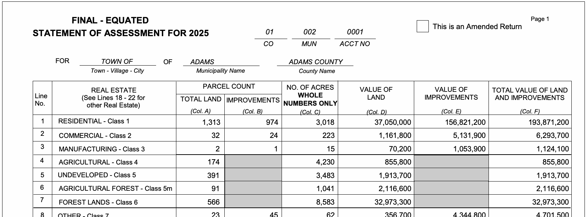

# parse_wi_soa

Parse Wisconsin **Statement of Assessment** (SOA) PDF forms into CSV.



&darr;

| Town/Village/City | Municipality Name | County Name | Line No. | Real Estate | Col A | Col B | Col C | Col D | Col E | Col F |
|---|---|---|---|---|---|---|---|---|---|---|
| Town | ADAMS | ADAMS | 1 | RESIDENTIAL - Class 1 | 1313 | 974 | 3018 | 37050000 | 156821200 | 193871200 |
| Town | ADAMS | ADAMS | 2 | COMMERCIAL - Class 2 | 32 | 24 | 223 | 1161800 | 5131900 | 6293700 |
| Town | ADAMS | ADAMS | 3 | MANUFACTURING - Class 3 | 2 | 1 | 15 | 70200 | 1053900 | 1124100 |
| ... | | | | | | | | | | |

Extracts Lines 1-9 (real estate classes) from each single-page form, including municipality header fields.

On Unix-like systems (macOS, Linux), it runs as a Python CLI or GUI. On Windows, a standalone .exe provides the GUI with no dependencies — just double-click and go.

## Requirements

- Python 3
- [pdfplumber](https://github.com/jsvine/pdfplumber) (`pip install pdfplumber`)

## Usage

### CLI

Parse one or more PDFs, outputting CSV to stdout:

```sh
bin/parse_wi_soa form1.pdf form2.pdf > output.csv
```

Only single-page SOA PDFs are accepted. Non-SOA forms and multi-page PDFs produce a clear error message.

### GUI

```sh
bin/parse_wi_soa_gui
```

Opens a tkinter window with two tabs:

- **Convert** — Load PDFs or a folder, auto-converts on selection, save results as CSV. Shows a green/red progress bar per file and an ETA for large batches.
- **Validate** — Compare tool output against hand-verified CSVs to spot-check accuracy.

### Windows .exe

Download `parse_wi_soa.exe` from the [releases page](https://github.com/jqr/parse_wi_soa/releases) — no Python install required. See [Building the Windows .exe](#building-the-windows-exe) if you want to build it yourself.

### Output columns

| Column | Source |
|--------|--------|
| Town/Village/City | Form header |
| Municipality Name | Form header |
| County Name | Form header |
| Line No. | 1-9 |
| Real Estate | Class description |
| Total Land (Col A) | Parcel count |
| Improvements (Col B) | Parcel count |
| No. of Acres (Col C) | Whole numbers only |
| Value of Land (Col D) | Assessed value |
| Value of Improvements (Col E) | Assessed value |
| Total Value of Land and Improvements (Col F) | Assessed value |

## Testing

Run tests against the validated fixtures in `validated/`:

```sh
bin/test
```

Validate an arbitrary directory of PDF/CSV pairs:

```sh
bin/validate_wi_soa /path/to/pairs/
```

To add a new test fixture, place a matching `name.pdf` and `name.csv` in `validated/`. The test suite auto-discovers all pairs.

## How it works

1. Extracts text from each PDF using `pdfplumber` with `extract_text(layout=True)`
2. Locates column positions dynamically from the `(Col. A)` through `(Col. F)` header row
3. Parses the municipality type, name, and county from the `FOR ... OF ...` header
4. Extracts class names via regex pattern matching (handles the fixed SOA form layout)
5. Assigns each numeric value on Lines 1-9 to its nearest column by right-edge proximity
6. Normalizes county names (strips trailing "COUNTY") and outputs plain integers

## Building the Windows .exe

`bin/build` produces a standalone Windows .exe using Docker, Wine, and PyInstaller. The only prerequisite is Docker with BuildKit (Docker Desktop includes this).

```sh
bin/build
```

The output lands in `dist/parse_wi_soa.exe` (~32 MB).

| | x86 | ARM Mac (Rosetta) |
|---|---|---|
| Cold build | ~1m40s | ~2m40s |
| Cached image | ~23s | ~67s |

Cold builds on ARM Macs may intermittently fail due to a Rosetta AVX emulation bug in Wine. Retrying usually works. Once the image is cached, ARM Macs run reliably.

### How it works

The Dockerfile creates a Debian container with Wine and a Windows Python environment:

1. Installs Wine (for running Windows Python) and Xvfb (virtual X display, required by Wine)
2. Downloads the Python 3.11 **embeddable package** (a zip, not the .exe installer) and extracts it
3. Installs pip via `get-pip.py` under Wine
4. Extracts tkinter files from the official Python MSIs using `msiextract` (a native Linux tool)
5. Installs pdfplumber and PyInstaller via pip under Wine

The build script then runs PyInstaller inside a container to bundle everything into a single .exe.

### Noteworthy issues and fixes

**Python installation under Wine.** The standard Python .exe installer silently fails under Wine (exit code 1, no files created). The embeddable zip package works reliably and includes the stdlib in a compressed `python311.zip`.

**tkinter is not included in the embeddable package.** The embeddable Python omits tkinter entirely. The necessary files (`_tkinter.pyd`, `tcl86t.dll`, `tk86t.dll`, Tcl/Tk scripts, and the `tkinter` Python package) come from the official Python MSI files (`tcltk.msi` and `lib.msi`). Installing these MSIs via `wine msiexec` silently fails — they appear to succeed but produce no files. The fix is to use `msiextract` (from the `msitools` Debian package) to extract the MSI contents natively on Linux and copy them into place.

**Embeddable Python path configuration.** The embeddable package uses `python311._pth` to control `sys.path` and does not include `DLLs/` or `Lib/` by default. Without adding these to the ._pth file, `import tkinter` fails and PyInstaller reports "tkinter installation is broken." The Dockerfile appends both directories to the ._pth file.

**PyInstaller can't write to Wine's Z: drive.** Docker volume mounts appear as `Z:\src` inside Wine. PyInstaller fails with `FileNotFoundError` when trying to create its `build/` directory on Z:. The build script copies source files to `C:\src` (inside Wine's virtual C: drive) and runs PyInstaller there, then copies the finished .exe back to the volume mount.

**xvfb-run hangs in Docker containers.** The `xvfb-run` wrapper script occasionally hangs indefinitely when used as the entrypoint for `docker run`. The build script starts `Xvfb` directly as a background process and sets `DISPLAY=:99` manually.

**File permissions.** The .exe is created by root inside the container. The build script `chmod`s it to be world-readable so the host user can access it without sudo.

**api-ms-win-crt-\*.dll warnings.** PyInstaller reports dozens of warnings about unresolved `api-ms-win-crt-*.dll` dependencies. These are Windows Universal CRT DLLs that are part of every modern Windows installation (Windows 10+) and don't need to be bundled. The warnings are harmless.

**cryptography DLL load failure.** PyInstaller warns about `ImportError: DLL load failed while importing _rust` from the cryptography package (a transitive dependency via pdfminer). This only affects the OpenSSL backend which is not used at runtime by pdfplumber. The warning is harmless.
